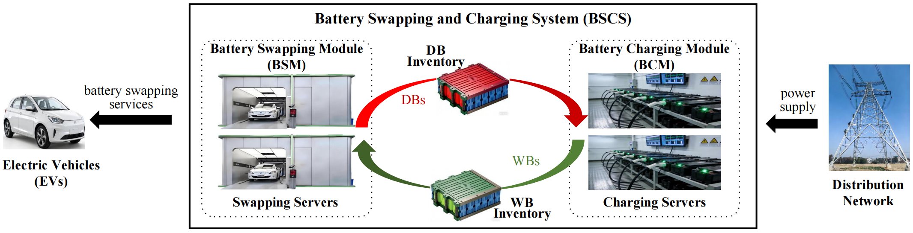

# PriBSCS Reproducibility Package

This repository contains the code and data package for reproducing the PriBSCS paper experiments.

## Project Overview

The system model is shown below.



Main documentation has been moved to:
- English + 中文: `docs/README.md`

## Quick Links

- Core scripts: `run.py`, `sensitivity.py`, `plot.py`
- Results data: `data_results/`
- Figures: `figures/`
- Dependencies: `requirements.txt`

## Quick Start

```bash
python3 -m venv .venv
source .venv/bin/activate
pip install -r requirements.txt
python run.py
python sensitivity.py
python plot.py
```

---

# PriBSCS 复现实验包（中文）

本仓库用于复现 PriBSCS 论文实验。

## 项目简介

系统模型配图如下：


主要说明文档已迁移至：
- 英文 + 中文：`docs/README.md`

## Citation

If this codebase is useful in your research, citing the following paper is appreciated:

```bibtex
@article{chi2026pribscs,
  title={PriBSCS: privacy-preserving distributed coordination for battery swapping and charging systems},
  author={Chi, Haotian and Zuo, Fei and Sun, Zhuocheng and Geng, Haijun and Wang, Yuwei and Jiang, Shunrong},
  journal={Journal of King Saud University Computer and Information Sciences},
  year={2026},
  doi={10.1007/s44443-026-00761-z}
}
```

## 引用

如果本代码仓库对你的研究有帮助，欢迎引用以下论文：

```bibtex
@article{chi2026pribscs,
  title={PriBSCS: privacy-preserving distributed coordination for battery swapping and charging systems},
  author={Chi, Haotian and Zuo, Fei and Sun, Zhuocheng and Geng, Haijun and Wang, Yuwei and Jiang, Shunrong},
  journal={Journal of King Saud University Computer and Information Sciences},
  year={2026},
  doi={10.1007/s44443-026-00761-z}
}
```
